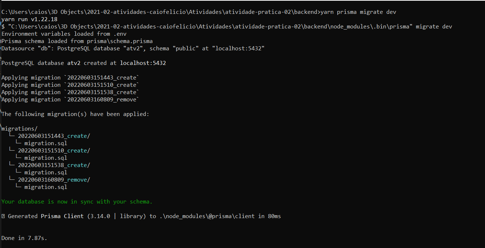
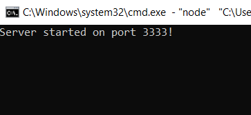
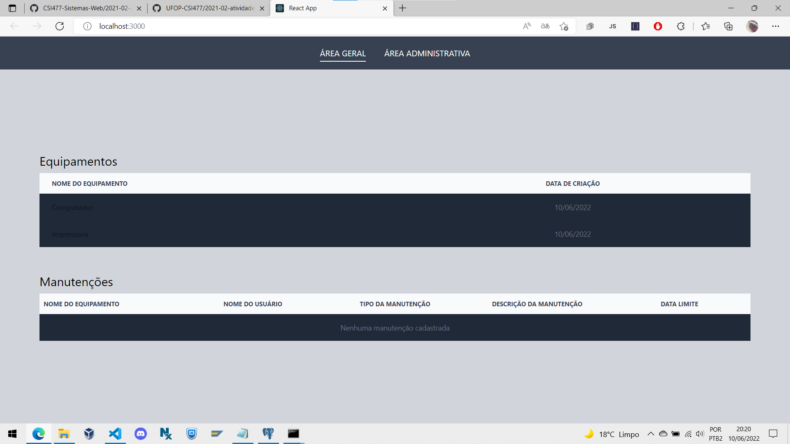

# Atividade prática 2

# 1 - Descrição:

Crie um projeto a partir do Laravel para o sistema. Realize as configurações necessárias no arquivo **[.env]**. As tabelas devem ser criadas por meio das migrations. Você pode utilizar outra tecnologia além do Laravel, seguindo as mesmas considerações e funcionalidades descritas na atividade.
<br></br>

# 2 - Requisitos para a execução do projeto:

 - [**NodeJs**](https://nodejs.org/en/)
 - **Yarn** - Veja [aqui](https://classic.yarnpkg.com/lang/en/docs/install/#windows-stable) como instalar.

# 3 - Para instalar as dependências do projeto:

## Backend

Entre na pasta [**backend**](../atividade-pratica-02/backend/) e rode o comando **yarn**. Esse comando irá instalar as dependências necessárias para rodar o backend. Foi utilizado o [**prisma**](https://www.prisma.io/) como ORM nessa atividade.

Depois de instalar as dependencia, crie um arquivo **.env** com o endereço do banco utilizado. Nesse caso, o postgres.

A seguir, um exmeplo de como deve ficar o arquivo **.env**:

```ts
DATABASE_URL="postgresql://<seu usuário do postgres>:<senha do postgres>@localhost:5432/<nome do banco>?schema=public"
SECRET=<coloque qualquer valor aqui>
```

A chave SECRET é utilizada no momento de geração do token [**JWT**](https://jwt.io/).

Após instalar as dependências, rode o comando `yarn prisma migrate dev` para executar as migrations que estão na pasta **[migrations](../atividade-pratica-02/backend/prisma/migrations/)**. 

**<center style="color: red">Não é necessário criar o banco previamente no Postgres. Caso ele não exista, o prisma criará automaticamente.</center>**

<br>

### Exemplo de saída de execução do comando:



Após essa etapa, execute o comando `yarn dev` para rodar o servidor na porta 3333.



Pronto, o backend está pronto para receber requisições.

<br>
<hr>
<br>

## Frontend

Entre na pasta [**frontend**](../atividade-pratica-02/frontend/) e rode o comando **yarn** para instalar as dependências necessárias. No frontend, foi utilizado o **[React](https://pt-br.reactjs.org/)**.

Para executar, basta esperar a instalação das dependências e em seguida rodar o comando `yarn start`, e uma aba no navegador será aberta, abaixo uma demonstração.


